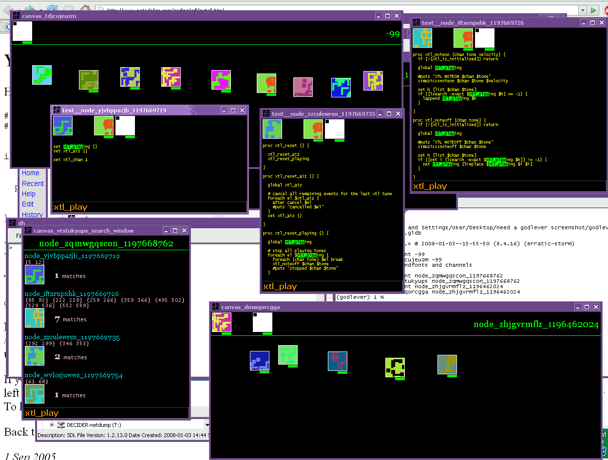

g-lever

Composed of a musical and unique graphical code editor, it utilizes two of the most important components of the human senses, the audio-visual sphere.

By coupling drag-and-drop (physical movement of the mouse) with a unique musical tune for each code block, as well as a unique graphical element for each code block, man moves through the code-space like a dervish on a sand-dune.

All code is kept in nodes. A node has a text block and a unique name. There are single-nodes, and multi-nodes. Multi-nodes have a little green underline bar over their icon. Nodes have icons which are randomly generated. Nodes have a musical tune which is randomly generated.

Code is stored in a local sqlite database

When you double click on a single-node, you will open its text block and you can edit it. When you double click on a multi-node, you will open a window showing you its child nodes. 

It's a tree, like you're used to.

You can search through the code space. Press Ctrl-S to search for text. There are two search functions, one for a multi-node, and one for a single-node. Try them both.

Press Ctrl-Q to save a text block in a single-node.

Press Alt-F12 to run the code. This will run the main/PROGRAM-NAME.exe file.

Press 'i' over a node to change its icon. It will generate a new one randomly for you. 

Press 'm' over a node to change its musical tune. Again, it's random.

Press Alt-F9 to make a backup of the code database and the generated source code. The code is generated from the code database.

